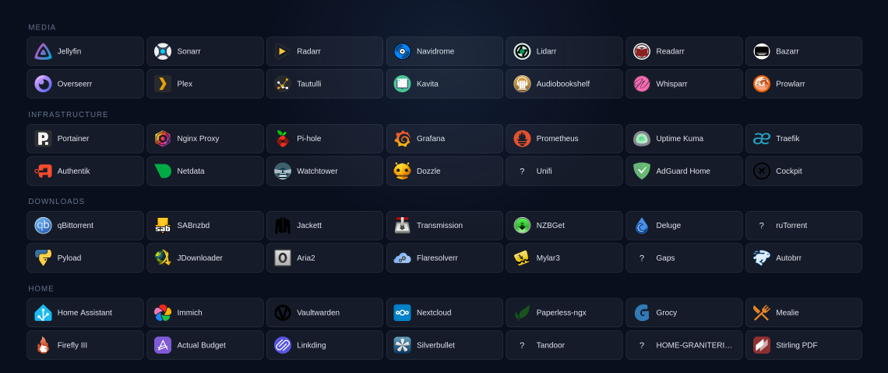
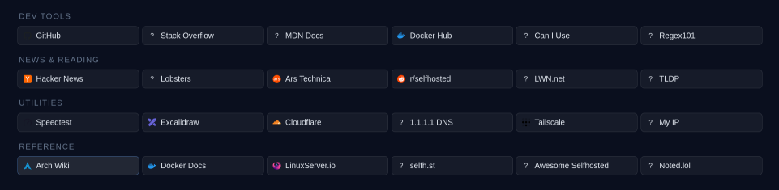

# Aerodash

A clean, fast, self-hosted dashboard for your homelab, inspired by [Homepage](https://gethomepage.dev). No frameworks, no dependencies, no build steps. Just download and run.

This project is vibe coded. The heavy lifting is done by LLMs with my oversight and extensive testing. It actually started as kind of a meme, to see how close I could get this dashboard to my previous setup with minimal prompting. To my surprise, the LLM got very close on the first try with an undetailed prompt, so I decided to take it further.

---

## Features

- **Services & bookmarks**: self-hosted apps and web links, grouped and organized your way
- **Multi-page support**: separate tabs for home, work, or whatever you need
- **Horizontal & vertical layouts**: card-per-row grid or traditional column view
- **Responsive UI**: column count automatically lowers to fit mobile devices when necessary
- **12 themes**: 6 dark, 6 light, paired by color family
- **Local icon support**: download links provided below, or use external resources like favicons
- **Icons toggle**: disable icons entirely for a cleaner text-only look
- **Persistent settings**: layout, theme, and display preferences are saved across sessions
- **Separate config**: your services and bookmarks live in `config.js`, never touched by updates

---

## Screenshots

**Services**



**Bookmarks**



**Options**


---

## Getting Started

```
aerodash/
└── site/
    ├── index.html
    ├── config.js          ← your config (gitignored)
    ├── config.example.js
    └── icons/             ← your icons (gitignored)
        ├── jellyfin.svg
        ├── sonarr.svg
        └── ...
```

1. Clone the repo: `git clone https://github.com/Aerowinder/aerodash` or `gh repo clone Aerowinder/aerodash`
2. Copy `/site/config.example.js` to `/site/config.js`
3. Edit `/site/config.js` with your services, URLs, and icon paths
4. Download icons from the links below and place them in `./site/icons/`. If you prefer or need favicons, those are also supported. This step is optional, can you hide all icons if you want.
5. Serve the `site/` folder from any web server (nginx, Apache, Caddy, etc)
6. Open it in your browser

---

## Services

Services are your self-hosted apps, grouped by category, each with a name, URL, and icon. Clicking a card opens the URL in a new tab (or same tab, depending on your Links setting).

## Bookmarks

Bookmarks are the same as services. The only difference is the size of the card.

## Options

The `OPTIONS` are hiding at the bottom center of Aerodash. The text is a button, click it to reveal the changeable settings.

All settings are saved to `localStorage` and restored on page load.

## Icons

Icons can be local files (`./icons/name.svg`) or any external URL. If an icon fails to load or isn't provided, a `?` is shown as a fallback.

Icons are not distributed with Aerodash. The best places to find them are:
* Site: [selfh.st/icons](https://selfh.st/icons), GitHub: [selfh.st/icons](https://github.com/selfhst/icons)
* Site: [Dashboard Icons](https://dashboardicons.com), GitHub: [Dashboard Icons](https://github.com/homarr-labs/dashboard-icons)

> Icons from selfh.st are licensed under [CC BY 4.0](https://creativecommons.org/licenses/by/4.0/). Attribution: [selfh.st/icons](https://selfh.st/icons).

> Icons from Dashboard Icons are licensed under [Apache 2.0](https://www.apache.org/licenses/LICENSE-2.0). Attribution [Dashboard Icons](https://dashboardicons.com).

---

## config.js

All your services and bookmarks live here. The git has a fully populated `config.example.js`, but here is a snippet so you can see how to make changes. 


This configuration example has 1 page (tab). Since it only has one tab, the tab selection will be hidden, but the structuring for the tabs must remain in the config.
```js
const CONFIG = {

  pages: [
    {
      name: 'TAB 1',
      services: [
        {
          group: 'Media',
          items: [
            { name: 'Jellyfin',        url: '#', icon: './icons/jellyfin.svg' },
            { name: 'Sonarr',          url: '#', icon: './icons/sonarr.svg' },
          ]
        },
        {
          group: 'Infrastructure',
          items: [
            { name: 'Portainer',       url: '#', icon: './icons/portainer.svg' },
            { name: 'Nginx Proxy',     url: '#', icon: './icons/nginx-proxy-manager.svg' },
          ]
        },
      ],
      bookmarks: [
        {
          group: 'Dev Tools',
          items: [
            { name: 'GitHub',          url: 'https://github.com',            icon: './icons/github.svg' },
            { name: 'Stack Overflow',  url: 'https://stackoverflow.com',     icon: './icons/stack-overflow.svg' },
          ]
        },
        {
          group: 'Utilities',
          items: [
            { name: 'Speedtest',       url: 'https://speedtest.net',         icon: './icons/speedtest.svg' },
            { name: 'Excalidraw',      url: 'https://excalidraw.com',        icon: './icons/excalidraw.svg' },
          ]
        },
      ],
    },
  ]
};
```

This configuration example has 2 pages (tabs). All tabs can have services and/or bookmarks. In this multi-tab configuration, a navigation block will appear at the top center of the site.
```js
const CONFIG = {

  pages: [
    {
      name: 'TAB 1',
      services: [
        {
          group: 'Media',
          items: [
            { name: 'Jellyfin',        url: '#', icon: './icons/jellyfin.svg' },
            { name: 'Sonarr',          url: '#', icon: './icons/sonarr.svg' },
          ]
        },
        {
          group: 'Infrastructure',
          items: [
            { name: 'Portainer',       url: '#', icon: './icons/portainer.svg' },
            { name: 'Nginx Proxy',     url: '#', icon: './icons/nginx-proxy-manager.svg' },
          ]
        },
      ],
      bookmarks: [
        {
          group: 'Dev Tools',
          items: [
            { name: 'GitHub',          url: 'https://github.com',            icon: './icons/github.svg' },
            { name: 'Stack Overflow',  url: 'https://stackoverflow.com',     icon: './icons/stack-overflow.svg' },
          ]
        },
        {
          group: 'Utilities',
          items: [
            { name: 'Speedtest',       url: 'https://speedtest.net',         icon: './icons/speedtest.svg' },
            { name: 'Excalidraw',      url: 'https://excalidraw.com',        icon: './icons/excalidraw.svg' },
          ]
        },
      ],
    },
    {
      name: 'TAB 2',
      services: [
        {
          group: 'Downloads',
          items: [
            { name: 'qBittorrent',     url: '#', icon: './icons/qbittorrent.svg' },
            { name: 'SABnzbd',         url: '#', icon: './icons/sabnzbd.svg' },
          ]
        },
        {
          group: 'Home',
          items: [
            { name: 'Home Assistant',  url: '#', icon: './icons/home-assistant.svg' },
            { name: 'Immich',          url: '#', icon: './icons/immich.svg' },
          ]
        },
      ],
      bookmarks: [
        {
          group: 'News & Reading',
          items: [
            { name: 'Hacker News',     url: 'https://news.ycombinator.com',  icon: './icons/hacker-news.svg' },
            { name: 'TLDP',            url: 'https://tldp.org',              icon: './icons/tldp.svg' },
          ]
        },
        {
          group: 'Reference',
          items: [
            { name: 'Arch Wiki',       url: 'https://wiki.archlinux.org',    icon: './icons/arch-linux.svg' },
            { name: 'Docker Docs',     url: 'https://docs.docker.com',       icon: './icons/docker.svg' },
            { name: 'Noted.lol',       url: 'https://noted.lol',             icon: './icons/noted.svg' },
          ]
        },
      ] 
    },
  ]
};
```

## Updating

Since `/site/config.js` and `/site/icons/` are gitignored, pulling updates will never overwrite your data:

```bash
git pull
```
