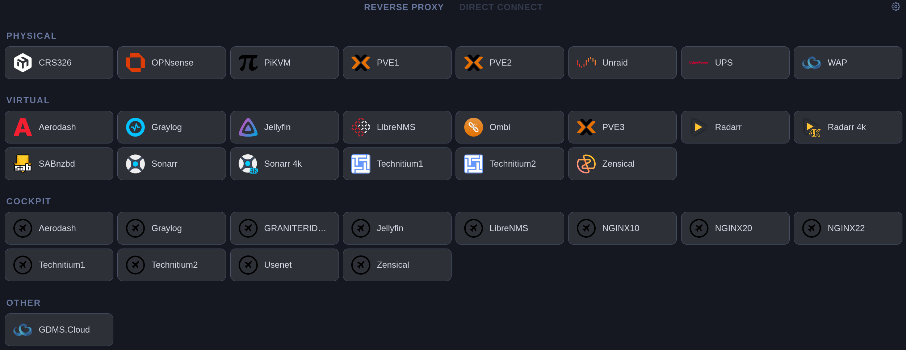
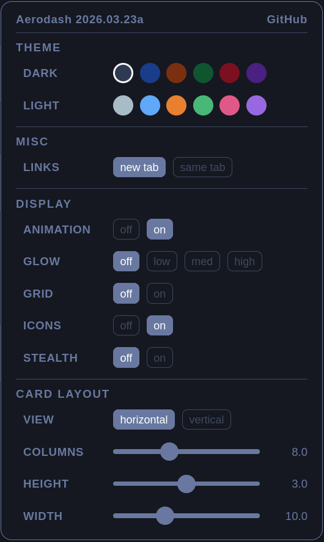

# Aerodash

Aerodash is a clean, fast, self-hosted homelab dashboard inspired by Homepage. Organize links into card groups across multiple tabs using extensive display and layout options.

This project is vibe coded. The heavy lifting is done by LLMs with my oversight and extensive testing.

---

## Screenshots

**Cards**



**Options**



---

## Getting Started

```
aerodash/
└── site/
    ├── index.html
    ├── config.js          ← your config
    ├── config.example.js
    └── icons/             ← your icons
        ├── jellyfin.svg
        ├── sonarr.svg
        └── ...
```

1. Clone the repo: `git clone https://github.com/Aerowinder/aerodash`
2. Copy `/site/config.example.js` to `/site/config.js`
3. Populate `/site/config.js` with your services, URLs, and icon paths
4. **OPTIONAL:** Download icons from the links below and place them in `./site/icons/`. Favicons are also supported.
5. Serve the `site/` folder from any web server, or just run it directly from your computer

---

## Options

The options sit behind the gear icon in the top right corner of the page. Click it to reveal all settings. Everything is saved to `localStorage` and restored on page load.

## Icons

Icons can be local files (`./icons/name.svg`) or any external URL. If an icon fails to load or isn't provided, no icon slot is shown.

Icons are not distributed with Aerodash. The best places to find them are:

- Site: [selfh.st/icons](https://selfh.st/icons) · GitHub: [selfhst/icons](https://github.com/selfhst/icons)
- Site: [Dashboard Icons](https://dashboardicons.com) · GitHub: [homarr-labs/dashboard-icons](https://github.com/homarr-labs/dashboard-icons)

> Icons from selfh.st are licensed under [CC BY 4.0](https://creativecommons.org/licenses/by/4.0/).

> Icons from Dashboard Icons are licensed under [Apache 2.0](https://www.apache.org/licenses/LICENSE-2.0).

---

## config.js

All your content lives here, structured as **Tabs** → **Groups** → **Cards**. Tabs are pages; if you only have one, the tab buttons are hidden. Groups are named collections of cards within a tab. Cards are individual links with a name, URL, and optional icon. Dividers are optional visual separators between groups, added with `{ divider: true }` between any two groups.

A fully populated `config.example.js` is included in the repo. Here's a minimal example showing all the concepts:

```js
const CONFIG = {

  tabs: [
    {
      name: 'Home',
      groups: [
        {
          name: 'Media',
          cards: [
            { name: 'Jellyfin',   url: 'http://jellyfin.local',  icon: './icons/jellyfin.svg'  },
            { name: 'Sonarr',     url: 'http://sonarr.local',    icon: './icons/sonarr.svg'    },
          ]
        },
        {
          name: 'Infrastructure',
          cards: [
            { name: 'Portainer',  url: 'http://portainer.local', icon: './icons/portainer.svg' },
          ]
        },
        { divider: true },
        {
          name: 'Links',
          cards: [
            { name: 'GitHub',     url: 'https://github.com',     icon: './icons/github.svg'    },
            { name: 'Speedtest',  url: 'https://speedtest.net',  icon: './icons/speedtest.svg' },
          ]
        },
      ]
    },
    {
      name: 'Work',
      groups: [
        {
          name: 'Tools',
          cards: [
            { name: 'Gitea',      url: 'http://gitea.local',     icon: './icons/gitea.svg'     },
          ]
        },
      ]
    },
  ]

};
```

---

## Updating

Your config (`/site/config.js`) and icons (`/site/icons/`) will never be modified by updates. Pulling updates is as simple as:

```bash
git pull
```

Just refresh the browser page and you will be good to go!
